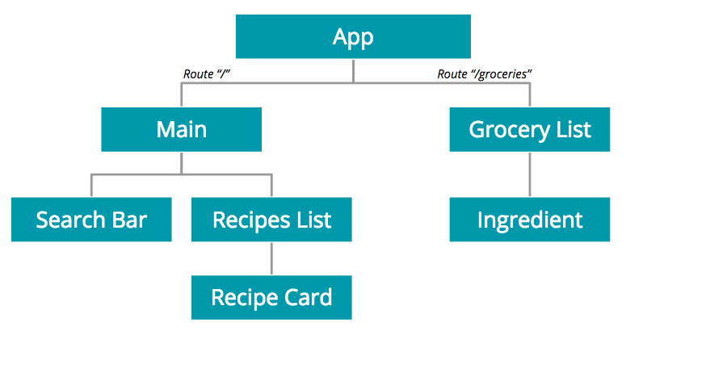

This project was bootstrapped with [Create React App](https://github.com/facebook/create-react-app).

## My Grocery Shopping App
#### By: Roger Teran

### User Stories

As a final project, I've made a Grocery Shopping App. As a user, I want to search for a type of food that I am in the mood for. Using a recipe API, the app will return a list of relevant recipes across the web. If I'm in the mood for a particular meal, I can add the ingredients I need for it into my `shopping list`.

As a user, I will also have the ability to navigate to the shopping list. In the shopping list, I will have a list of ingredients I need to get at the grocery store to make my chosen meals. If I don't need a particular ingredient, or if I've just gotten it, I can remove a specific item from the list.

### Technologies Used

* React - JS library for building interactive user interfaces
* React Router - collection of components that mimic navigating multiple pages
* Axios - JS library to perform promise-based HTTP requests
* Edamam API - free recipe-focused API
* Semantic UI - minimal styling that is neutral but elegant

### App Structure

Component Hierarchy:

### Key Challenges

Biggest challenge for me was how to pass state from a lower-level component back up to the `App` or some higher-level component. I ran into this challenge three times:

  * Storing the query term from the search bar component
  * Getting the ingredients from a chosen recipe
  * Removing an item from the grocery list

The pattern I followed was to define a function in the higher-level component where the state is located - I used this function to eventually set state again. Then, I passed the function down all the way to the lower-level component where an action would occur. At the lower-level component, I would create an event listener that would get called upon some element event (eg. onClick) happening. In the body of the lower-level component, I'd pass in the function from the higher-level component - which I could access through the props system - as a callback. Lastly, I'd invoke the callback with some form of state from the lower-level component.

Another challenge I ran into was implementing react router. Specifically, for the ingredients selected, I had to pass them up into a higher-level component after selecting a specific recipe. Once they were stored as state, I had to pass them back down to a Grocery List component so that they could be rendered. Initially, I only had an App component but it made it difficult to create a `/` and a `/groceries` route. I therefore refactored a large portion of the App component into a separate main component - this made having 2 routes more feasible. It was also tricky to pass in props to the routes components, and had to implement a particular pattern that calls render and then passes in a component. Not sure what exactly is going on here, but it works.

Last challenge I faced was calling the API using fetch. It kept throwing an error whenever I'd access the response of the request. I installed an npm package called `axios`, and after some initial setup, I got it to work just fine.

### What's Next?

I'd love to dig into `Redux` for more advanced state management. This application is very small, but I could sense it was getting a bit tricky to manage state across the different components. I'd also like to store data using Firebase - didn't have the time to get to it during the project. Lastly, would like to work on some user authentication to make it into a more robust app.
